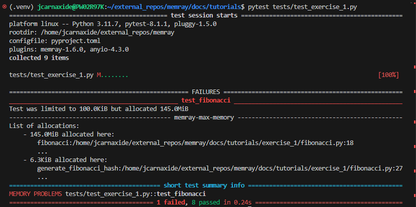

Exercise 1: Fibonacci Sequence
================================

Intro
---------

This first lesson's focus is to familiarise you with the methods and tools we will be using for the
rest of the exercises. By the end of it, you should understand:

- Basic integration of memray with pytest
- How to run a python script with memray
- How to generate and interpret a flamegraph

In this first example, we will be calculating and printing the results of a fibonacci sequence of a
specified number of elements. Python has some great standardised practices for iterating over large
sequences that you will have an opportunity to learn about.

Development Environment Setup
-----------------------------

TODO

Pytest plugin for Memray
------------------------

Memray supports the ability to augment your pytests and implement an upper bound memory limit for
your code. This will then cause the test to either pass or fail, depending on the total amount of
memory used during the tests execution. Take a look at exercise 1's test, there is a line that specifies
``@pytest.mark.limit_memory`` . This is how we set our upper bound memory limit. These are used for
all of the tests covered in this workshop.

Executing the tests
^^^^^^^^^^^^^^^^^^^

Pytest is already installed in your docker image, so you can simply invoke it to execute your tests.
Run the following command in your docker image's shell, it will search all subdirectories for tests.
This will test the entire workshop.

.. code:: shell

    pytest

This can be tedious to test everything when we are working on 1 example at a time. To save time,
let's specify the specific test we want to run.

.. code:: shell

    pytest tests/test_exercise_1.py

Understanding the results
^^^^^^^^^^^^^^^^^^^^^^^^^

Do you notice any issues with your test case? Initially we should see that the test is failing with
some additional information. Looks like our test case allocated more memory than we alloted for. We
will be taking advantage of this amazing feature included with Memray to help run our workshop. Your
goal for each exercise will be to modify the exercises (NOT the tests), in order to respect these memory limits.

Flamegraphs, what are they?
---------------------------

Ok so we know our test is broken, how can we use memray to help us dive deeper into the underlying
problem? The answer, is a flamegraph! A flamegraph is an HTML file that can be used to visualize how
your program utilises memory at the point in time where the memory usage is at its peak.

.. image:: _static/images/exercise1_flamegraph.png

On the middle portion of the screen, we can see the memory usage plotted vs time. (Y axis is memory
used, X axis is time) Down below, this is plotted where each row is a stack in your trace, and the
width represents memory used. (X axis is memory used)

You can click into a particular row to filter out results below it and focus on that call.

Generating a flamegraph
^^^^^^^^^^^^^^^^^^^^^^^

Navigate to the TODO directory via

.. code:: shell

    cd TODO

Run the first exercise labeled fibonacci.py, but make sure to have memray wrap this call.

.. code:: shell

    memray run fibonacci.py

After the run is complete, memray will conveniently print the command to generate a flamegraph from
the memray output file. Your run id will change each time you run memray with the exercise

.. code:: shell

    memray flamegraph memray-fibonacci.py.<run-id>.bin

Now that we have generated our flamegraph, you can launch the HTML output file in your browser of
choice.

Challenge
---------

Take a closer look at the stack on the flamegraph - you will notice that the ``output.append`` line of
code appears to be the source of almost all of our script's allocations. Maybe that could be used as
a clue as to what in particular we may want to change to pass our test?

Try to edit ``fibonacci.py`` to make the program more memory efficient. Test your solution by running
the ``test_exercise_1.py`` unit test, and inspect the effect your changes have on the memory allocation by
generating new flamegraphs. Ensure you don't break any of the correctness tests along the way as well.

.. raw:: html

    

    
<i>Toggle to see the sample solution</i>

     
    After examining the flamegraph, we can see that the problem is caused by this intermediate array
    <code>output</code> that we are using in order to capture and return the results of the calculation.
      
    Python has an amazing construct that works perfectly in this situation called
    <a href="https://wiki.python.org/moin/Generators">Generators</a>.
      
    To explain it simply, a generator works by pausing execution of your function, and saving its state
    on the stack (so its not necessarily free), once we finish our iteration, we can return to that
    paused function in order to retrieve the next value that is needed. This is much more memory
    effective than processing the entire loop and saving the results in memory (especially when you have
    100,000 iterations!)

    <pre>
    <code style="display: block; white-space: pre-wrap;" >
    def fibonacci(length):
        # edge cases
        if length < 1:
            return
        if length == 1:
            yield 1
            return

        left = right = 1
        yield left
        yield right

        for _ in range(length - 2):
            left, right = right, left + right
            yield right
    </code>
    </pre>

    Full code solution <a href="https://github.com/bloomberg/memray/blob/main/docs/tutorials/solutions/exercise_1/fibonacci.py">here</a>
    

Conclusion
----------

We should try to avoid loading the entire result set into memory (like into a list) when we plan to
iterate on that result set anyways. This is especially true when your result set is very large. It is
typically best to work with generators in these types of cases. Note: sometimes it is important to do
all the calculations upfront too, it may vary from case to case.

Using Memray's flamegraph can be a quick and easy way to identify where your applications memory usage
bottle neck is.