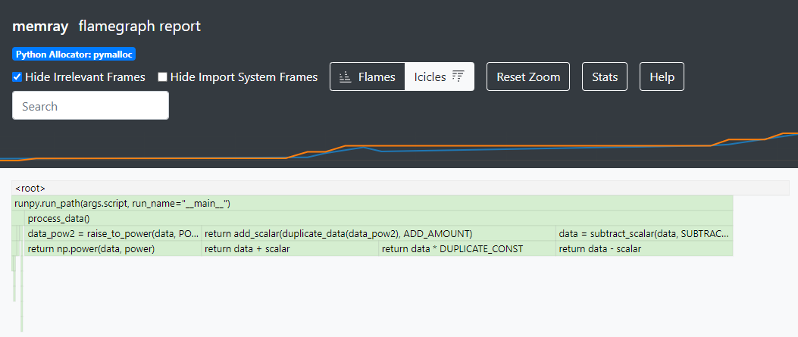

Exercise 2: Clinging Onto Memory
================================

Intro
-----------

Unlike languages such as C++, Python will manage our memory for us, and free up the memory that's no longer necessary . Python's automatic memory management makes our lives easier, however, sometimes, it may not work the way you would expect it to...

Working Through an Example
^^^^^^^^^^^^^^^^^^^^^^^^^^^

Let's go through a working example of when memory management in Python doesn't work in the ways we'd typically expect it to, coming from other programming languages.

Exercise
"""""""""""

Let's have a look at the example in ``holding_onto_memory.py``: how many MB of memory do we use at peak? Take a guess, and then confirm by running ``memray`` and generating a ``flamegraph``.

Expectations vs Reality
"""""""""""""""""""""""
Let's presume that we can’t mutate the original data, the best we can do is peak memory of 200MB: for a brief moment in time both the original 100MB of data and the modified copy of the data will need to be present. In practice, however, the actual peak usage will be 400MB as demonstrated by the ``flamegraph``:

Examining our flamegraph further, we can see that we peak at 400MB of allocated memory due to three allocations:
1. Original 100MB array created by ``load_xMb_of_data(100)``
2. The second modified array, created by ``raise_to_power()``
3. Inside ``add_scalar()``, the first modified array, created by ``data_pow()``, is held in memory (100MB) until a scalar is added to it (another 100MB) and returned. Only once ``add_scalar()`` has returned, the 200MB used get deallocated together.

Challenge
"""""""""""

Experiment with the code in ``holding_onto_memory.py`` and try to get the peak memory usage down to 200MB. Test your solutions by running the unit test in ``tests/test_exercise_2.py`` and examine them with the help of ``memray`` reports.

Solutions
""""""""""""""

.. raw:: html

   

   
<i>Toggle to see the sample solutions</i>

   After examining the flamegraph, we can see that the problem is caused by local variables which are no longer needed, but continue to use memory until <code>process_data()</code> has finished running. Therefore, we need to look for refactoring the method in a way that does not use unnecessary variables to store data that will not be read afterwards. There are two main approaches we can use to solve our issue here:

   <ul>
   <li>Using no local variables all together in <code>process_data()</code> and instead returning the result of nested function calls

   <pre>
   <code style="display: block; white-space: pre-wrap;" >
   def process_data():
      # no extra reference to the original array
      return add_scalar(
         duplicate_data(
               raise_to_power(
                  subtract_scalar(
                     load_xMb_of_data(SIZE_OF_DATA_IN_MB),
                     SUBTRACT_AMOUNT
                  ),
                  POWER_AMOUNT
               )
         ),
         ADD_AMOUNT
      )
   </code>
   </pre>

   </li>

   <li>Applying the pattern of hidden mutability - we can create a single variable, and re-use it multiple times to store the new value of the manipulated array. This way, we will only hold one array in memory at a time, instead of holding on to older versions of the mutated array unnecessarily

   <pre>
   <code style="display: block; white-space: pre-wrap;" >
   def process_data():
      # reusing the local variable instead of allocating more space
      # this approach is called 'hidden mutability'
      data = load_xMb_of_data(SIZE_OF_DATA_IN_MB)
      data = subtract_scalar(data, SUBTRACT_AMOUNT)
      data = raise_to_power(data, POWER_AMOUNT)
      data = duplicate_data(data)
      data = add_scalar(data, ADD_AMOUNT)
      return data
   </code>
   </pre>
   </li>
   </ul>

   Full code solution <a href="https://github.com/bloomberg/memray/blob/main/docs/tutorials/solutions/exercise_2/holding_onto_memory.py">here</a>

   

Conclusion
^^^^^^^^^^^

Typically, holding onto data in memory a little longer than needed is not a big issue. However, when we are working with large objects, we should be particularly careful. Over-allocating unnecessary memory can lead to running out of memory on the machine (especially for linux VMs which are typically smaller than the older physical machines).

Memray can be a helpful tool when trying to debug where we are over-allocating memory unnecessarily.

More resources:

- A more detailed walkthrough with a `similar example <https://pythonspeed.com/articles/function-calls-prevent-garbage-collection/>`_
- Another `related article <https://pythonspeed.com/articles/minimizing-copying/>`_ about unnecessary memory allocation
- A great `article <https://pythonsimplified.com/mutability-immutability-in-python/>`_ on mutability and immutability in Python
