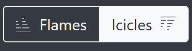

Flame Graph Reporter
====================

The flame graph reporter generates an HTML file containing a flame graph
representation of the allocations contributing to the tracked process's peak
memory usage.

Flame graphs are a way to visualize how your program is spending its time.
A few important things about flame graphs:

- The flame graph displays the superposition of all stack traces that
  lead to memory allocations at a given time (normally the time when the
  total amount of allocated memory was highest).

- A flame graph can't tell you how many times a function was called,
  only how much memory that function allocated.

- A stack trace is represented as a column of boxes, where each box
  represents a function call.

- The x-axis **does not show the passage of time**, so the left-to-right
  ordering has no special meaning: every level just shows the collection
  of functions that were called by the nodes immediately under them.

- The y-axis shows the stack depth, ordered from root at the bottom to
  leaf at the top. The top box shows the function that made a memory
  allocation and everything beneath that is its ancestry. The function
  beneath a function is its parent.

- The width of each function box represents how much memory was
  allocated by that function or its children. Functions with wider boxes
  allocated more bytes of memory than those with narrower boxes, in
  proportion to their width.

Interpreting flame graphs
-------------------------

Flame graphs can be interpreted as follows:

- The nodes at the bottom of the flame graph represent functions that
  allocated memory.

- For quickly identifying the functions that allocated more memory
  directly, look for large plateaus along the bottom edge, as these show
  a single stack trace was responsible for a large chunk of the total
  memory of the snapshot that the flame graph represents.

- Reading flame graphs from the bottom up shows ancestry relationships.
  Every function is called by its parent, which is shown directly above
  it; the parent was called by its parent shown above it, and so on.
  A quick scan upward from a function identifies how it was called.

- Reading flame graphs from the top down shows code flow and the bigger
  picture. A function calls all child functions shown below it, which,
  in turn, call functions shown below them. Reading top down also shows
  the big picture of code flow before various forks split execution into
  smaller shafts.

- You can directly compare the width of function boxes: wider boxes
  mean more memory was allocated by the given node, so those are the
  most important to understand first.

- Major forks in the flame graph (when a node splits into several ones in
  the next level) can be useful to study: these nodes can indicate
  a logical grouping of code, where a function processes work in stages,
  each with its own function. It can also be caused by a conditional
  statement, which chooses which function to call.

- If the application is multi-threaded, the stacks of all the threads
  that contribute to the memory peak will appear commingled in the flame
  graph by default.

Simple example
--------------

.. code:: python

   def a(n):
       return b(n)

   def b(n):
       return [c(n), d(n)]

   def c(n):
       return "a" * n

   def d(n):
       return "a" * n

   a(100000)

This code allocates memory from the system allocator in just 2 places:
``c()``, and ``d()``. This is how the flame graph looks:

.. image:: _static/images/simple_example.png

Here you can see that ``a()`` called ``b()`` and that ``b()`` called
``c()`` and ``d()``, which in turn did some allocations. As the boxes of
``c()`` and ``d()`` are of the same width, you know that both allocated
the same amount of memory.

A more complete example
-----------------------

.. code:: python

   def a(n):
       return [b(n), h(n)]

   def b(n):
       return c(n)

   def c(n):
       missing(n)
       return d(n)

   def missing(n):
       return "a" * n

   def d(n):
       return [e(n), f(n), "a" * (n // 2)]

   def e(n):
       return "a" * n

   def f(n):
       return g(n)

   def g(n):
       return "a" * n * 2

   def h(n):
       return i(n)

   def i(n):
       return "a" * n

   a(100000)

This code allocates memory from the system allocator in 5 places:
``e()``, ``d()``, ``g()``, ``i()`` and ``missing()``. The associated
flame graph looks like this:

.. image:: _static/images/complex_example.png

The top edge shows that function ``g()`` allocates the most memory,
``d()`` is wider, but its exposed top edge is smaller, which means that
``d()`` itself allocated less memory than the one allocated by the
functions called by it. Functions including ``b()`` and ``c()`` do
not allocate memory themselves directly; rather, the functions they
called did the allocating.

Functions beneath ``g()`` show its ancestry: ``g()`` was called by
``f()``, which was called by ``d()``, and so on.

Visually comparing the widths of functions ``b()`` and ``h()`` shows
that the ``b()`` code path allocated about four times more than ``h()``.
The actual functions that did the allocations in each case were their
children.

A major fork in the code paths is visible where ``a()`` calls ``b()``
and ``h()``. Understanding why the code does this may be a major clue to
its logical organization. This may be the result of a conditional (if
conditional, call ``b()``, else call ``h()``) or a logical grouping of
stages (where ``a()`` is processed in two parts: ``b()`` and ``h()``).
In our case we know is the second case, as ``a()`` is creating a list
with the result of ``b()`` and ``h()``.

If you look carefully you can notice that ``missing()`` allocates
memory, but it does not appear in the flame graph. This is because at
the time the largest memory peak was reached (when ``a()`` returned) the
memory allocated by ``missing()`` didn't contribute at all to the total
amount of memory. This is because the memory allocated by ``missing()``
is deallocated as soon as the call ends.

With this information, we know that if you need to choose a place to start
looking for optimizations, you should start looking at ``g()``, then
``e()`` and then ``i()`` (in that order) as these are the places that
allocated the most memory when the program reached its maximum. Of
course, the actual optimization may be done in the callers of these
functions, but you have a way to start understanding where to optimize.

Non-relevant frame hiding
-------------------------

The flame graph exposes a button to show or hide frames which might be
distracting when interpreting the results, either because they were
injected by Memray or because they are low-level implementation
details of CPython. By default, frames tagged as irrelevant are
hidden. You can reveal them by unchecking the *Hide Irrelevant Frames*
checkbox:

.. image:: _static/images/non_relevant_checkbox.png
    :align: center

Note that allocations in these frames will still be accounted for
in parent frames, even if they're hidden.

Flames versus Icicles
---------------------

The flame graphs explained above show each function above its caller,
with the root at the bottom. This is what's traditionally called
a "flame graph", because the wide base with narrowing columns above it
looks sort of like a burning log with flames leaping into the air above
it. Memray also supports what's sometimes called an "icicle graph",
which has the root at the top. In an icicle graph, each function is
below its caller, and there is a wide ceiling that thinner columns
descend from, like icicles hanging from a roof. Whichever of these modes
you choose, the data shown in the table is the same, just mirrored
vertically.

You can switch between showing a flame graph and an icicle graph with
this toggle button:

.. _memory-leaks-view:

Memory Leaks View
-----------------

When generating flame graphs, the ``--leaks`` option can be specified
to get information for memory that was leaked during the tracking
(i.e. allocated after tracking started and not deallocated by the time
tracking ended).

.. important::

    The Python allocator doesn't necessarily release memory to the system
    when Python objects are deallocated and these can still appear as
    "leaks". When you use the ``--leaks`` option, you should usually
    also run your application with the ``PYTHONMALLOC=malloc``
    environment variable set. See our documentation on :doc:`python
    allocators <python_allocators>` for details.

.. _split-threads-view:

Split-Threads View
------------------

When generating flame graphs, the ``--split-threads`` option can be
specified to get thread-specific filtering on the flame graph.

If ``--split-threads`` is not specified, thread information is not
displayed on the flame graph. Instead, allocations occurring at the same
source location across different threads are grouped together. However,
if ``--split-threads`` is used, the allocation patterns of individual
threads can be analyzed.

When opening the report, the same merged thread view is presented, but
a new "Filter Thread" dropdown will be shown. This can be used to
select a specific thread to display a flame graph for that one thread:

.. image:: _static/images/filter_thread_dropdown.png

To go back to the merged view, the "Reset" entry can be used in the
dropdown menu.

Note that the root node (displayed as **<root>**) is always present
and is displayed as thread 0.

.. _temporal flame graphs:

Temporal Flame Graphs
---------------------

As noted above, the snapshots generated by ``memray flamegraph`` normally show
you only a single point in time. By default, that's the point when the
process's heap memory usage was highest. If you provide the ``--leaks`` option,
it instead shows the point when tracking ended, so that you can inspect what
was still allocated at that point.

If the ``--temporal`` option is provided, ``memray flamegraph`` will create
a unique type of flame graph that we call a "temporal flame graph". In this
mode, the flame graph can show you not just one point in time, but instead the
usage over time (with approximately 10 millisecond granularity by default).

A temporal flame graph includes a chart of the process's memory usage over time
at the top of the page, and two sliders.

.. image:: _static/images/temporal_high_water_mark_controls.png

If you don't use the ``--leaks`` option, the temporal flame graph will show you
data about the point in your chosen time range where heap memory usage was at
its highest. Because the sliders are initially on the two extreme ends, it
starts off showing you exactly what the non-temporal report would: the moment
during tracking when the highest amount of heap memory was used. Moving the
left slider lets you ignore any high water mark that happened before it, and
moving the right slider lets you ignore any high water mark that happened after
it. You can use these to focus in on what your process's heap memory usage was
at any point during its run. The particular time slice within your chosen
window where Memray found the high water mark is highlighted, though you might
not be able to see it unless you zoom in enough that a 10 millisecond time
slice is wide enough.

If you use the ``--leaks`` option, the temporal flame graph will show you
allocations performed within the time window you select and not freed by the
end of it. Because the sliders are initially on the two extreme ends, it starts
off showing you exactly what the non-temporal leaks report would: allocations
performed at any point after tracking started and not freed before tracking
ended. Moving the left slider lets you ignore allocations made before the point
you select. Moving the right slider lets you look for allocations that hadn't
been freed as of an arbitrary point in time, rather than only seeing ones that
weren't freed before tracking stopped.

These temporal reports can be used to gain fine grained insight into how your
process was using memory at any point during its run, which can be invaluable
for understanding its memory usage patterns.

.. note::

    Temporal flame graphs contain much more data than the default non-temporal
    flame graphs, so they're slower to generate, and the generated HTML files
    are also larger. They can't be generated from :ref:`aggregated capture
    files <aggregated capture files>`, which don't contain the necessary data
    about allocations over time. They also can't be used for finding
    :doc:`temporary allocations </temporary_allocations>`.

You can see an example of a temporal flamegraph
`here <_static/flamegraphs/memray-flamegraph-fib.html>`_.

Conclusion
----------

Flame graphs are effective visualization tools for a memory snapshot of
a program. They give an insightful visual map for the execution of
Python code and allow navigating areas of interest, letting you
identify where to start looking for improvements. Unlike other code-path
visualizations such as acyclic graphs, flame graphs convey information
intuitively using line lengths and can handle large-scale profiles,
while usually remaining readable on one screen.

Basic Usage
-----------

The general form of the ``flamegraph`` subcommand is:

.. code:: shell

    memray flamegraph [options] <results>

The only argument the ``flamegraph`` subcommand requires is the capture file
previously generated using :doc:`the run subcommand <run>`.

The output file will be named ``memray-flamegraph-<input file name>.html``
unless the ``-o`` argument was used to override the default name.

Reference
---------

.. argparse::
    :ref: memray.commands.get_argument_parser
    :path: flamegraph
    :prog: memray

    --leaks : @replace
        Enables :ref:`memory-leaks-view`, where memory that was not deallocated is displayed, instead of peak memory
        usage.

    --split-threads : @replace
        Enables :ref:`split-threads-view`, where each thread can be displayed separately. Allocations on the same source
        line across different threads are not merged, if this flag is passed.
