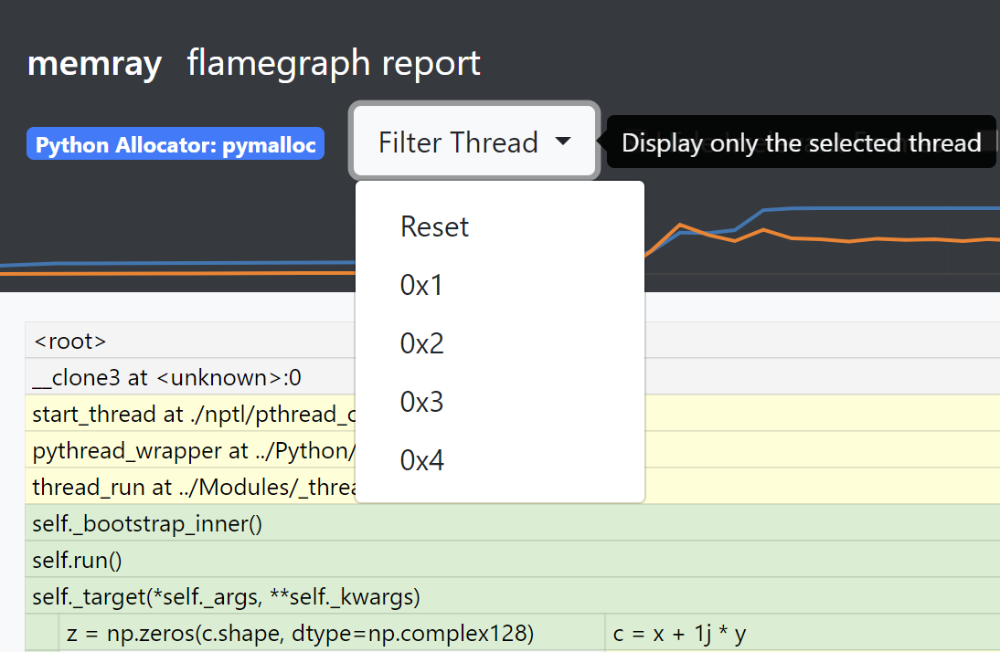

Flame graph
===========

Flame graphs are a way to visualize how your program is spending its
time. A few important things about flame graphs:

-  The flame graph displays the superposition of all stack traces that
   lead to memory allocations at a given time (normally the time where
   the memory reached its highest value).

-  You can’t tell from a flame graph how many times a function was
   called. You can only tell how much memory was allocated by the given
   function.

-  A stack trace is represented as a column of boxes, where each box
   represents a function.

-  The x-axis **does not show the passage of time**, so the
   left-to-right ordering has no special meaning: every level just shows
   the collection of functions that were called by the nodes inmediately
   under them.

-  The y-axis shows the stack depth, ordered from root at the bottom to
   leaf at the top. The top box shows the function that made a memory
   allocation and everything beneath that is its ancestry. The function
   beneath a function is its parent.

-  The width of each function box represents how much memory was
   allocated by that function or its children in the stack trace
   ancestry. Functions with wide boxes allocated more memory with
   respect to the snapshot that the flame graph is representing than
   those with narrow boxes, in proportion to their widths.

Interpreting flame graphs
-------------------------

Flame graphs can be interpreted as follows:

-  The nodes at the top of the flame graph represent functions that
   allocated memory.

-  For quickly identifying the functions that allocated more memory
   directly, look for large plateaus along the top edge, as these show a
   single stack trace was responsable for a large chunk of the total
   memory of the snapshot that the flame graph represents.

-  Reading the flame graph from top down shows the ancestry
   relationship: Every function is called by its parent, which is shown
   directly below it; the parent was called by its parent shown below
   it, and so on. A quick scan downward from a function identifies how
   it was called.

-  Reading the flame graph from bottom up shows code flow and the bigger
   picture. A function calls all child functions shown above it, which,
   in turn, call functions shown above them. Reading bottom up also
   shows the big picture of code flow before various forks split
   execution into smaller towers.

-  You can directly compare the width of function boxes as wider boxes
   mean more memory was allocated by the given node and those are the
   most important to understand first.

-  Major forks in the flame graph (when a node splits in several ones in
   the next level) can be useful to study: these nodes can indicate a
   logical grouping of code, where a function processes work in stages,
   each with its own function. It can also be caused by a conditional
   statement, which chooses which function to call.

-  If the application is multi-threaded, the stacks of all the threads
   that contribute to the memory peak will appear in the flame graph.

Simple example
--------------

.. code:: python

   def a(n):
       return b(n)

   def b(n):
       return [c(n), d(n)]

   def c(n):
       return "a" * n

   def d(n):
       return "a" * n

   a(100000)

This code allocates memory in just 2 places: ``c()``, and ``d()``. This
is how the flame graph looks like:

.. image:: _static/images/simple_example.png

Here you can see that ``a()`` called ``b()`` and that ``b()`` called
``c()`` and ``d()``, that in turn did some allocations. As the boxes of
``c()`` and ``d()`` are of the same width, you know that both allocated
the same amount of memory.

A more complete example
-----------------------

.. code:: python

   def a(n):
       return[b(n), h(n)]

   def b(n):
       return c(n)

   def c(n):
       missing(n)
       return d(n)

   def missing(n):
       return "a" * n

   def d(n):
       return [e(n), f(n), "a" * (n // 2)]

   def e(n):
       return "a" * n

   def f(n):
       return g(n)

   def g(n):
       return "a" * n * 2

   def h(n):
       return i(n)

   def i(n):
       return "a" * n

   a(100000)

This code allocates memory in 5 places: ``e()``, ``d()``, ``g()``,
``i()`` and ``missing()``. The associated flame graph looks like this:

.. image:: _static/images/complex_example.png

The top edge shows that function ``g()`` allocates the most memory,
``d()`` is wider, but its exposed top edge is smaller, which means that
``d()`` itself allocated less memory than the one allocated by the
functions called by it. Functions including ``b()`` and ``c()`` do not
not allocate memory themselves directly; rather, their child functions
did the allocation.

Functions beneath ``g()`` show its ancestry: ``g()`` was called by
``f()``, which was called by ``d()``, and so on.

Visually comparing the widths of functions ``b()`` and ``h()`` shows
that the ``b()`` code path allocated about four times more than ``h()``.
The actual functions that did the allocations in each case were their
children.

A major fork in the code paths is visible where ``a()`` calls ``b()``
and ``h()``. Understanding why the code does this may be a major clue to
its logical organization. This may be the result of a conditional (if
conditional, call ``b()``, else call ``h()``) or a logical grouping of
stages (where ``a()`` is processed in two parts: ``b()`` and ``h()``).
In our case we know is the second case, as ``a()`` is creating a list
with the result of ``b()`` and ``h()``.

If you look carefully you can notice that ``missing()`` allocates
memory, but it does not appear in the flame graph. This is because at
the time the largest memory peak was reached (when ``a()`` returned) the
memory allocated by ``missing()`` didn’t contribute at all to the total
amount of memory. This is because the memory allocated by ``missing()``
is deallocated as soon as the call ends.

With this information we know that if you need to chose a place to start
looking for optimizations, you should start looking at ``g()``, then
``a()`` and then ``i()`` (in that order) as these are the places that
allocated the most memory when the program reached its maximum. Of
course, the actual optimization may be done in the callers of these
functions, but you have a way to start understanding where to optimize.

Hiding/Showing Non-Relevant Frames
----------------------------------

The flame graph exposes a button to show or hide frames which might be
distracting when interpreting the results either because they were
injected by memray or because they are low-level implementation
details of CPython. By default, frames tagged as non-relevant are
hidden. You can reveal them with the "Show Non-Relevant Frames"
checkbox:

.. image:: _static/images/non_relevant_checkbox.png
    :align: center

Note that allocations in these frames will still be accounted for
in parent frames as these aggregate allocations in their children.

.. _memory-leaks-view:

Memory Leaks View
-----------------

When generating flame graphs, the ``--leaks`` option can be specified
to get information for memory that was leaked during the tracking
(i.e. allocated and not deallocated).

.. important::

    The Python allocator doesn't necessarily release memory to the system
    when Python objects are deallocated and these can still appear as
    "leaks". If you want to exclude these, you can run your application
    with the `PYTHONMALLOC=malloc` environment variable set.

.. _split-threads-view:

Split-Threads View
------------------

When generating flame graphs, the ``--split-threads`` option can be
specified to get thread-specific filtering on the flame graph.

If ``--split-threads`` is not specified, thread information is not
displayed on the flame graph. This is because allocations occurring
at the same source location across different threads are merged.
If however this flag is specified in the :doc:`cli/flamegraph`
subcommand, allocations across threads can be represented separately
on the flame graph.

When opening the report, the same, merged thread view is presented.
However, the "Filter Thread" drop down will also visible and this
can be used to select a specific thread to display:

To go back to the merged view, the "Reset" entry can be used in the
drop down menu.

Note that the root node (displayed as **memray**) is always present
and is displayed as thread 0.

Conclusion
----------

Flame graphs are effective visualization tools for a memory snapshot of
a program. It creates an insightful visual map for the execution of
Python code and allows to navigate areas of interest, allowing you to
identify where to start looking for improvements. Unlike other code-path
visualizations such as acyclic graphs, flame graphs convey information
intuitively using line lengths and can handle large-scale profiles,
while usually remaining readable on one screen.
