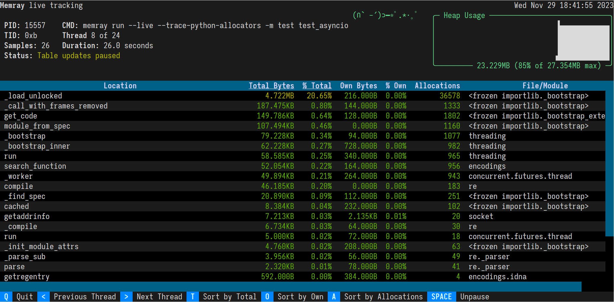

.. _Live Tracking:

Live tracking
=============

Overview
--------

``memray`` supports presenting a "live" view for tracking the heap memory usage of a running Python program.
This provides a holistic view of how much memory is being allocated, as the program is being executed.

It is designed to help investigate how a program is allocating memory as it executes, what the peak heap usage has been,
and analyze how much memory is being allocated by various parts of the program. The information is presented in a
tabular format, showing how much memory each function/method has allocated ("owned"), how much memory has been
cumulatively allocated by this and all subfunctions ("total") and the number of calls to allocators like `malloc` have
been made by the program.

Usage
-----

You can specify the program to be profiled in live mode using ``run --live``:

.. code:: shell-session

  $ memray3.9 run --live dmpexample.py
  Run 'memray3.9 live <port>' in another shell to see live results

As you can see, ``memray`` is now waiting on a connection to the live tracking server. You can now attach to
the server using running the ``live`` command in a separate shell.

.. code:: shell-session

  $ # in a different shell
  $ memray3.9 live <port>

This command will connect to the server that was started in the previous command, when given the requested port number.
Once the connection is established, the program will start executing. All memory allocations and deallocations
throughout the program will be tracked.

The program being tracked will present its output on the shell running the ``run --live`` command. In the shell running
the ``live`` command, information about the program will be presented with a summary and allocation information in a
tabular format.

.. image:: _static/images/live_running.png

This view presents the following information:

- What the PID is of the running process.
- What command was used to invoke the program.
- The current heap size and the peak heap size seen so far.
- How long the program has been running.
- How many snapshots of the memory (referred to as samples) have been presented.
- A plot of the heap size over time.

Once the program has exited, there will be a message presented in the live view, stating that "Remote has disconnected".

.. image:: _static/images/live_disconnected.png

Sorting results
---------------

The results are displayed in descending order of total memory allocated by a function and the subfunctions called by
it. You can change the ordering with the following keyboard shortcuts:

- t (default): Sort by total memory
- o: Sort by own memory
- a: Sort by allocation count

The sorted column is highlighted with ``< >`` characters around the title.

Viewing different threads
-------------------------

By default, the ``live`` command will present the main thread of the program. You can look at different threads of the
program by pressing the left and right arrow keys.

Using a different port
----------------------

It is possible to make ``run --live`` start the server on a user-specified port, using the ``--live-port`` argument.

.. code:: shell-session

  $ python3.9 -m memray run --live --live-port 12345 dmpexample.py
  Run 'memray3.9 live 12345' in another shell to see live results

.. important::

  Due to the syntax of the command line arugments of memray, make sure that you pass any options intended for the
  ``run`` command *before* your script/module. Otherwise, they will be treated as arguments for the script and will not
  be used by ``memray``.

  For example, the following invocation will try running ``python3.9 dmpexample.py --live-port 12345``:

  .. code:: shell-session

    $ python3.9 -m memray run --live dmpexample.py --live-port 12345
    Run 'memray3.9 live 60125' in another shell to see live results

Using with :doc:`native mode <native>`
--------------------------------------

It is possible to use :doc:`native mode <native>` along with the live mode. This can be achieved by passing ``--native``
to the ``run`` command.

.. code:: shell-session

  $ python3.9 -m memray run --live --native dmpexample.py
  Run 'memray3.9 live 60125' in another shell to see live results
