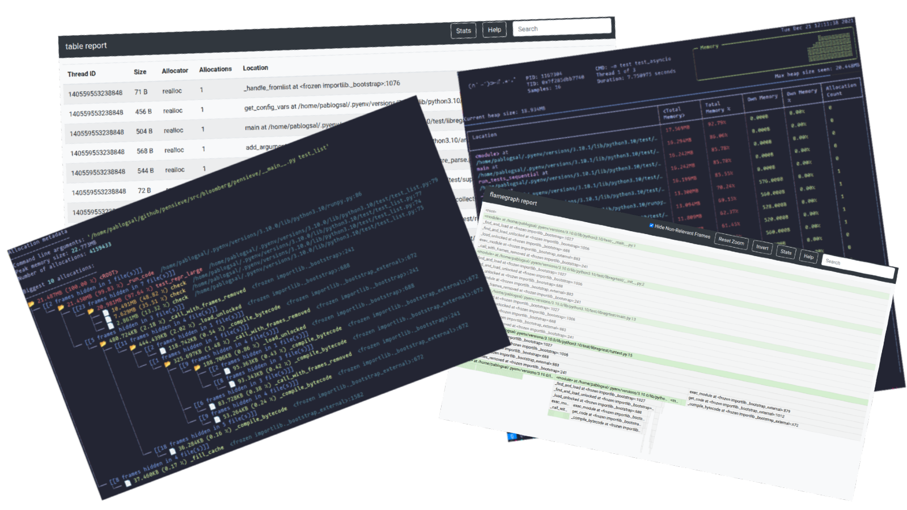

Overview
--------

.. image:: _static/images/logo.png

Memray is a memory profiler for Python. It can track memory allocations in Python code, in native extension
modules, and in the Python interpreter itself. It can generate several different types of reports to help you
analyze the captured memory usage data. While commonly used as a CLI tool, it can also be used as a library to
perform more fine-grained profiling tasks.

Notable features:

- 🕵️‍♀️ Traces every function call so it can accurately represent the call stack, unlike sampling profilers.
- ℭ Also handles native calls in C/C++ libraries so the entire call stack is present in the results.
- 🏎 Blazing fast! Profiling causes minimal slowdown in the application. Tracking native code is somewhat slower, but this can be enabled or disabled on demand.
- 📈 It can generate various reports about the collected memory usage data, like flame graphs.
- 🧵 Works with Python threads.
- 👽🧵 Works with native-threads (e.g. C++ threads in native extensions)

Memray can help with the following problems:

- Analyze allocations in applications to help discover the cause of high memory usage.
- Find memory leaks.
- Find hotspots in code which cause a lot of allocations.

.. image:: _static/images/quotes.png
   :align: center

.. note::
    Memray only works on Linux and MacOS, and cannot be installed on other platforms.
