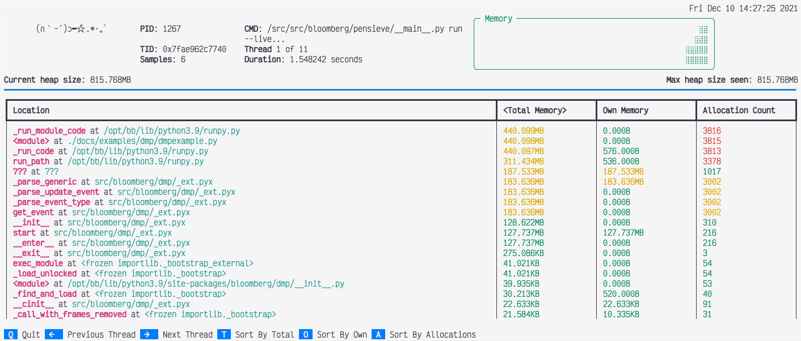

The ``run`` subcommand
======================

The ``run`` subcommand is used to launch a new Python process and track the memory allocations it
performs while it runs.

Basic tracking
--------------

The general form of the ``run`` subcommand is one of:

.. code:: shell

    memray run [options] file.py [args]
    memray run [options] -m module [args]

Like the Python interpreter itself, the ``run`` subcommand can take a path to a Python file to run,
or the name of a Python module to run if you use the ``-m`` flag. While it runs, memory allocations
and deallocations throughout the program are tracked. By default they are saved into a file with the
following pattern:

``memray-<script>.<pid>.bin``

where ``<script>`` is the name of the executed script and ``<pid>`` is the process id it ran with.

A different filename can be provided with the ``-o`` or ``--output`` argument.

.. _Native tracking:

Native tracking
---------------

Overview
~~~~~~~~

Memray supports tracking native C/C++ functions as well as Python functions. This can be especially useful
when profiling libraries that have extension modules (such as ``numpy`` or ``pandas``) as this
gives a holistic vision of how much memory is allocated by the extension and how much is allocated by Python itself.

For instance, consider the Mandelbrot example from the :ref:`example-applications` section with native tracking
disabled. Some of the most important allocations happen when operating on NumPy arrays:

.. image:: _static/images/mandelbrot_operation_non_native.png

Here, we can see that the allocation happens when doing some math on NumPy arrays but unfortunately this doesn't inform us
of what exact operation is allocating memory or how temporaries are being used. We also don't know if the memory was
allocated by NumPy or by the interpreter itself. By using the native tracking mode with Memray we can get a much richer report:

.. image:: _static/images/mandelbrot_operation_native.png

In this native report, we can see all the internal C calls that are underneath. We can see that the memory allocation
happens when the NumPy arrays are being added, due to ``PyNumber_Add`` appearing in the stack trace. Based on
``PyNumber_Multiply`` not appearing in the stack trace, we can conclude that the temporary array created by NumPy is
immediately freed (or that it didn't need to allocate memory in the first place, perhaps because it could reuse some
already allocated memory).

.. tip::
    Memray will also include *inlined* functions and *macros* when native tracking is enabled.

.. caution::
    Activating native tracking has a moderate impact on performance as every instruction pointer in the call stack needs
    to be resolved whenever an allocation happens. This effect is more noticeable the more allocations the traced
    application performs.

Check the :doc:`section on native symbolification <native_mode>` for more
information on how to obtain the best reports with native information, and on
how to debug problems in reports with native information.

Usage
~~~~~

To activate native tracking, you need to provide the ``--native`` argument when using the ``run`` subcommand:

.. code:: shell

  memray run --native example.py

This will add native stack information to the result file, which any reporter will automatically use.

.. important::
   When generating reports for result files that contain native frames, the report needs to be generated **on the same
   machine** where the result file was generated. This is because the shared libraries that were loaded by the process
   need to be inspected by Memray to get the correct symbol names.

When reporters display native information they will normally use a different color for the Python frames than the native
frames. This can also be distinguished by looking at the file name in a frame, since Python frames will generally come
from source files with a ``.py`` extension.

Python allocator tracking
-------------------------

Memray normally tracks allocation and deallocation requests made to the system
allocator, but by default it won't see individual Python objects being created.
That's because the Python interpreter normally uses its own memory pools for
creating most objects, only making calls to the system allocator as needed to
grow or shrink its memory pools. Our documentation on :doc:`python allocators
<python_allocators>` describes this memory pooling in greater detail. This
behavior speeds the Python interpreter up, and by extension speeds up profiling
with Memray, while still allowing Memray to show you each place where your
program needs to acquire more memory.

You can ask Memray to show you each individual object being created and
destroyed, instead, by providing the ``--trace-python-allocators`` argument to
the ``run`` subcommand. This records a lot more data and makes profiling much
slower. It will show you all allocations, even ones that don't result in your
program requesting more memory from the system because the interpreter already
had memory available for reuse. It can be useful in some cases, though,
especially when tracking down memory leaks.

.. note::
  This acts also as an alternative way to run with ``PYTHONMALLOC=malloc`` but
  in a way that allows distiguishing allocations made by using the system
  allocator directly and ones made by using the Python allocator.

.. code:: shell

  memray run --trace-python-allocators example.py

.. caution::
  Tracking the Python allocators will result in much larger report files and
  slower profiling due to the larger amount of data that needs to be collected.

.. _Live tracking:

Live tracking
-------------

Overview
~~~~~~~~

Memray supports presenting a "live" view for observing the memory usage of a running Python program.

Usage
~~~~~

You can run a program in live mode using ``run --live``:

.. code:: shell

  memray3.9 run --live application.py

Immediately Memray will start your application in the background and will run a TUI in the foreground that you can use
to analyze your application's memory usage. If you don't want to run your program in the background, you can instead
use ``run --live-remote``:

.. code:: shell

  memray3.9 run --live-remote application.py

In this mode, Memray will choose an unused port, bind to it, and display a message saying:

.. code:: text

  Run 'memray live <port>' in another shell to see live results

It will wait for you to run:

.. code:: shell

   memray3.9 live <port>

in another terminal window to attach to it. Regardless of whether you choose to use one terminal or two, the resulting
TUI is exactly the same. See :doc:`live` for details on how to interpret and control the TUI.

.. _Tracking across forks:

Tracking across forks
---------------------

Overview
~~~~~~~~

Memray can optionally continue tracking in a child process after a parent process forks. This can be useful when using
``multiprocessing``, or a framework utilizing a pre-fork pattern like Celery or Gunicorn.

Usage
~~~~~

To activate tracking through forks, you need to provide the ``--follow-fork`` argument to the ``run`` subcommand:

.. code:: shell

  memray run --follow-fork example.py

In this mode, each time the process forks, a new output file will be created for the new child process, with the new
child's process ID appended to the original capture file's name. The capture files for child processes are exactly like
any other capture file, and can be fed into any reporter of your choosing.

.. note::

  ``--follow-fork`` mode can only be used with an output file. It is incompatible with ``--live``
  mode and ``--live-remote`` mode, since the TUI can't be attached to multiple processes at once.

Losing capture files after OOM Errors
-------------------------------------

When a process runs out of memory, this commonly causes an Out Of Memory error,
or "OOM Error". That causes the process to be killed by its operating system.
Within orchestrations like Kubernetes the termination of the main process might
immediately lead to the destruction of the container and the loss of the files
that Memray uses to collect its results.

When running ``memray run myprogram.py`` a capture file gets created on the file
system, but the entire file system will be thrown away as soon as the
orchestration cleans up the container. If the program exits unexpectedly,
perhaps because the kernel kills it due to an OOM error, the orchestration might
throw away the capture file before you ever get a chance to use it. Since Memray
is often used to chase memory leaks, this condition might happen more often than
you'd like.

Since Memray is running in the same process as your application, it has no way
to prevent this data loss (by sending it over the network, for example) because
any work it does will be terminated when the process crashes.

Instead of directly calling ``memray run myprogram.py`` you can wrap it in
a script that will run Memray and run post-processing operations on the capture
file. That way, the container won't be destroyed by the orchestration until
after the wrapper script exits, rather than being destroyed as soon as the
Python script being tracked by Memray exits.

.. code-block:: shell

  memray run --output /tmp/capture.bin myprogram.py
  echo "Program finished"
  # Do your post-processing here. This example just logs a summary of what's
  # in the capture file, but you might want to generate reports from it and
  # copy them over the network to some persistent storage, for instance.
  memray summary /tmp/capture.bin

.. _aggregated capture files:

Aggregated capture files
------------------------

If you supply the ``--aggregate`` argument to ``memray run``, it will write
much smaller capture files. Instead of containing information about every
individual allocation performed by the tracked program, a capture file produced
using ``--aggregate`` will contain some statistics about the process's
allocations aggregated by the location where the allocation happened.

Specifically, for every location where the tracked process performed any
allocations, an aggregated capture file includes a count of:

- How many allocations at that location had not yet been deallocated when the
  process reached its heap memory high water mark
- How many bytes had been allocated at that location and not yet deallocated
  when the process reached its heap memory high water mark
- How many allocations at that location were leaked (i.e. not deallocated
  before tracking stopped)
- How many bytes were leaked by allocations at that location

These counts provide enough information to generate flame graphs. In fact, this
information is enough to run most of our reporters, with just a few exceptions:

- You cannot find :doc:`temporary allocations </temporary_allocations>` using
  this capture file format, since finding temporary allocations requires
  knowing when each individual allocation was deallocated.
- You cannot use the :doc:`stats reporter <stats>` with this capture file
  format, because it needs to see each individual allocation's size.
- You cannot use ``--aggregate`` with :ref:`live tracking <live tracking>`,
  since the live TUI needs to see each allocation as it happens.

Also, note that if the process is killed before tracking ends (for instance, by
the Linux OOM killer), then the process will die before it finishes calculating
its statistics, and so no useful information is ever written to the capture
file. With the default file format, the capture file is usually still usable
even if the process crashes or is killed, but with the aggregated file format
it is not.

If you can live with these limitations, then using ``--aggregate`` results in
much smaller capture files that can be used seamlessly with most reporters.

CLI Reference
-------------

.. argparse::
   :ref: memray.commands.get_argument_parser
   :path: run
   :prog: memray
