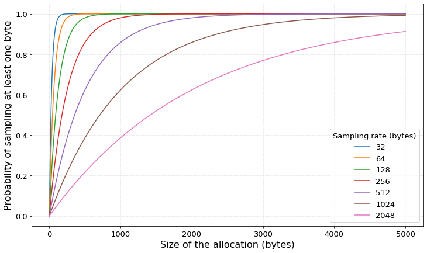
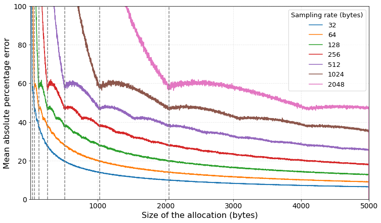

Sampling
========

In this section we explain in detail what is sampling profiling and how is implemented
in `memray`. 

Bernoulli process
-----------------

The idea is that in order to avoid having to record all allocations we decide to
take random samples from them. instead of randomly deciding to take or not
individual allocations (which can be of different sizes) we think of the bytes
individually as a stream. For every byte, we throw a coin (can be biased, not
necesarily having probability of 50%) and we decide if the byte will be recorded
or not. When you do this for a very very large amount of bytes where the
probability of choosing every byte is remains constant this is called a
"Bernoulli process".The reason we use this statistical approach, as opposed to
taking every nth byte, is that there may be regular allocation patterns in the
code that may be missed by a correspondingly regular sampling.

To account for the sampling process, we need to scale every byte that we decide
to sample to the correct scale. We do this by multiplyng by the sampling size
(the inverse of the probability of choosing a byte). For example if we sample a
byte with probability of 40%, then each byte sampled represents statistically 40
bytes allocated.

The implementation is a bit different, though. The reason is that throwing a
random number for every single byte allocated is too expensive to do in
practice. We could sample from the Poisson distribution that would tell us the
number of samples that we need to take per allocation (how many bytes we need to
sample in a collection of "n bytes" that form a complete allocation) but this is
still too expensive, because it forces us to still throw a random number from
the Poisson distribution (which is expensive) per allocation. What we do instead
(and other sampling profilers as well) is to use the Exponential distribution.
The exponential distribution tells us the amount of bytes we need to wait until
the next sample needs to be taken. This is much better than throwing a random
number per allocation, because in this way we need to throw one random number
(that gives us how many bytes we need to wait for), then keep substracting bytes
to this number until it reaches 0 and then we can take a sample and do it all
over again. This means that for many allocations we just need to substract from
the number of remaining bytes instead of throwing a random number.

As is customary in this method, an optimization here is that if a given
allocation is bigger than the average ammount of bytes we need to wait until the
next sample, we take it directly as is very likely that we are going to sample
it at least once.

All this process is dependent on the probability of sampling a single byte in
the Bernoulli process, which is the inverse of how many bytes on average we need
to wait until the next sample. Choosing this number wisely is very important for
good results.

.. note:: 

    This random distribution approach has several advantages: first, its
    statistical properties make then very easy to estimate actual statistical
    characteristics of the heap. Indeed, we certainly want large allocated
    blocks to weight more than small ones. Second, Poisson process are
    relatively easy to simulate with reasonable performance.

Algorithm
---------

As many other profilers that implement sampling using this method, the algorith `memray`
follows is:

* We draw a random number from the exponential distribution with a given sample rate. This tells us how many bytes
  we must wait until taking a sample.

* An allocation is being tracked.

* If the allocation size is bigger than the sampling size, we sample the entire allocation with its original size. We do
  this becuse the probability tht we are going to take at least one sample is very high and therefore is a good performance
  optimization.

* If the allocation size smaller than our sampling size, then we substract the size of the allocation from the ammount of bytes
  we need to wait until we take a sample. If this number reaches zero, we take a sample and we draw another random number from
  the exponential distribution. The amount of times we had to draw from the exponential distribution is the number of samples
  the allocation should count as.

* We multiply the number of samples we drew within the allocation by the sampling rate to get an estimate of the statistical
  size of the allocation. We record this allocation and its stack as if the allocation had the statistical size that we obtained.

Performance
-----------

Sampling ``1/p`` bytes (where ``p`` is the probability of choosing a given byte)
has an impact on the coverage of the bytes we sample and therefore on the
accuracy of the results. For example, choosing a very small value for ``p``
(which means we will wait a lot for taking samples) will give us a lot of speed
(because we won't be sampling many allocations) but will cost us a lot in
accuracy. On the other hand, setting ``p=1`` will give us perfect accuracy, as
we will be sampling every single byte. We need to understand how ``p`` impacts
our accuracy so we can choose the right value for every situation.

In the following figure, you can see the probability of taking a sample
for different sampling sizes, depending on the allocation size.  We can
see from the chart below that if we 16X our sampling rate from 32B to 512B
we still have a 95% chance of sampling anything above 1.5KiB. If we 64X it to
2048B we still have an 80% chance to sample anything above 3.5KiB.

In the following figure, the `Mean absolute percentage error
<https://en.wikipedia.org/wiki/Mean_absolute_percentage_error>`_ is displayed
for different sampling sizes and different allocation sizes under the assumption
that the allocations that have at least one sample. These are the allocations that
will be dumped to the result file. You can read the graph in the following way:
"Given a particular sampling rate and an allocation size, when the sampler finally
decides to take a sample, how far off are we going to account for the allocation
compared with its true size?". For example, considering allocations of 1 byte
and a sampling size of 1024 bytes, as the sampler sees the first allocations it
will do nothig because the sampling size is mich bigger (1024 bytes vs 1 bytes)
but when it finally decides to take a sample (how many bytes it will wait for
is determined by a random number from the exponential distribution) then it will
weight that single byte as if it were an allocation of 1024 bytes. As the
algorith samples the entire allocation if its size is bigger or equal than the
sampling size, dashed vertical lines are displayed in these points. For a given
line, all points to the right of the vertical line have in reality an error of
zero.

References
----------

* `Bernoulli process <https://en.wikipedia.org/wiki/Bernoulli_process>`_
* `Bernoulli sampling <https://en.wikipedia.org/wiki/Bernoulli_sampling>`_
* `Statistically profiling memory in OCaml <https://jhjourdan.mketjh.fr/pdf/jourdan2016statistically.pdf>`_
* `Perfetto design document <https://perfetto.dev/docs/design-docs/heapprofd-sampling>`_
