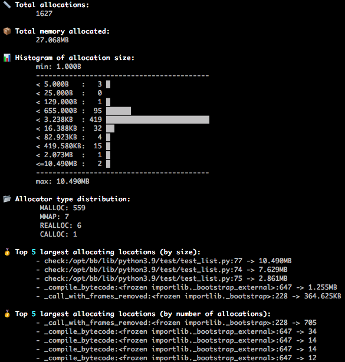

Stats Reporter
==============

The stats reporter generates high level allocation statistics of the target at the time when the memory usage was at its peak. 
Optionally, it is possible to view the stats for *all* allocations.

The output of the reporter consists of the following:

* Total number of allocations performed

* Sum of all memory allocated

* Histogram displaying the distribution of allocation sizes. The y-axis data (size) may not be evenly spaced

* Distribution of allocation types (e.g. *MALLOC*, *CALLOC* etc.)

* Stack trace and **size** of the top 'n' largest allocating locations by size (*default: 5*, configurable with the ``-n`` command line param)

* Stack trace and **count** of the top 'n' largest allocating locations by number of allocations (*default: 5*, configurable with the ``-n`` command line param)

**Important Note**
By default, the statistics are displayed only for the time when the memory usage was at its peak. However, it is possible to use the ``-a`` command line argument to consider all allocations throughout the life of the process. Note that including all allocations could slow down this reporter drastically.
