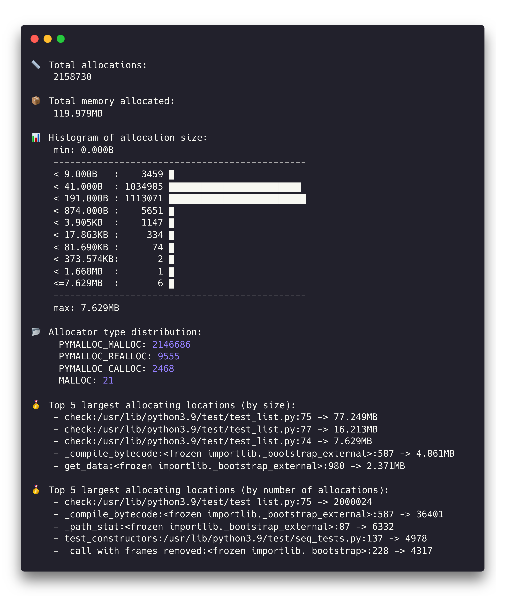

Stats Reporter
==============

The stats reporter generates high level statistics about the tracked process's
memory allocations. By default, it computes these statistics for the moment when
the tracked process's memory usage was at its peak, but it can optionally
compute the stats for *all* allocations instead.

The output includes the following:

* Total number of allocations performed

* Total amount of memory allocated

* Histogram displaying the distribution of allocation sizes. The y-axis data (size) is logarithmic.

* Distribution of allocation types (e.g. *MALLOC*, *CALLOC*, *MMAP*, etc.)

* Stack trace and **size** of the top 'n' largest allocating locations by size (*default: 5*, configurable with the ``-n`` command line param)

* Stack trace and **count** of the top 'n' largest allocating locations by number of allocations (*default: 5*, configurable with the ``-n`` command line param)

.. note::

    By default, the statistics are displayed only for the time when the memory
    usage was at its peak. However, it is possible to use the ``-a`` command
    line argument to consider all allocations throughout the life of the
    process. Including all allocations slows this reporter down drastically.

Basic Usage
-----------

The general form of the ``stats`` subcommand is:

.. code:: shell

    memray stats [options] <results>

The only argument the ``tree`` subcommand requires is the capture file
previously generated using :doc:`the run subcommand <run>`.

The output will be printed directly to the standard output of the terminal.

CLI Reference
-------------

.. argparse::
   :ref: memray.commands.get_argument_parser
   :path: stats
   :prog: memray
