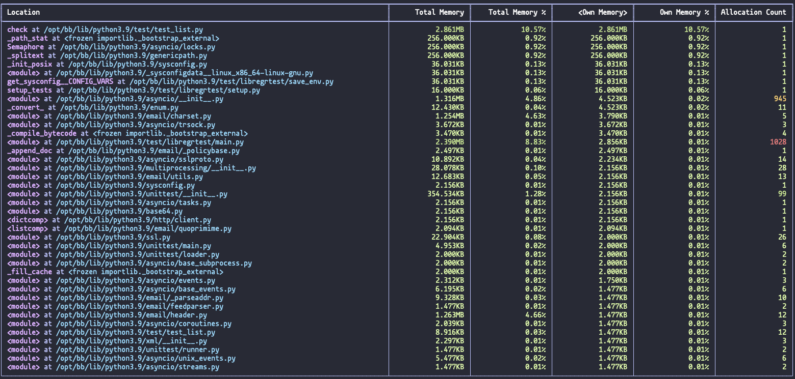

Summary Reporter
================

The summary reporter provides a quick view on some statistics of the highest watermark allocation records
as well as a table showing how much memory each function/method has allocated ("owned"), how much memory has been
cumulatively allocated by this and all subfunctions ("total") and the number of calls to allocators like `malloc` have
been made by the program. Allocations for different threads are displayed in the same table and are not segregated.