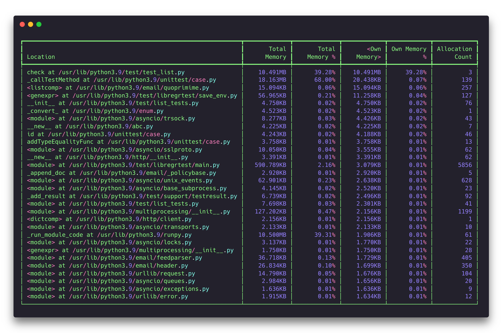

Summary Reporter
================

The summary reporter provides a quick overview of allocated memory at the time
when the tracked process's memory usage was at its peak. It displays a table
showing how much of that peak memory each function directly allocated ("own
memory"), how much was cumulatively allocated by that function and everything
it called ("total memory"), and the cumulative count of not yet freed
allocations performed by that function and everything it called ("allocation
count"). Allocations for different threads are aggregated together and shown in
the same table.

Basic Usage
-----------

The general form of the ``summary`` subcommand is:

.. code:: shell

    memray summary [options] <results>

The only argument the ``summary`` subcommand requires is the capture file
previously generated using :doc:`the run subcommand <run>`.

The output will be printed directly to standard output. If standard output is
a terminal, the output will be colorized.

CLI Reference
-------------

.. argparse::
   :ref: memray.commands.get_argument_parser
   :path: summary
   :prog: memray
