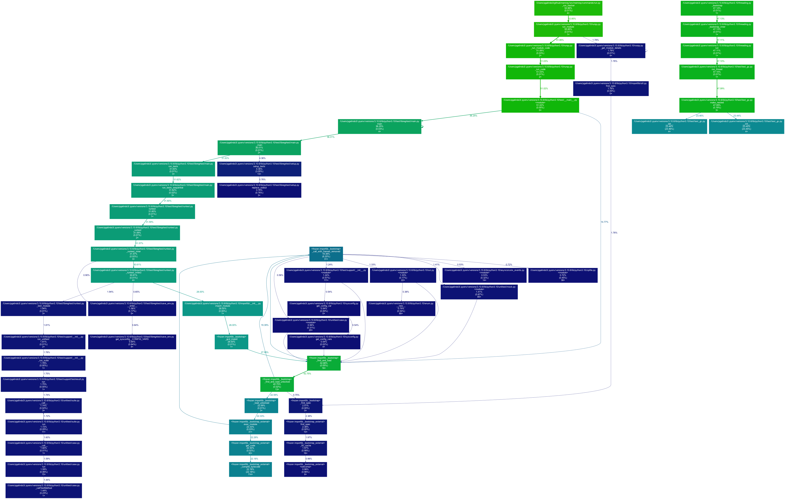

Transform Reporter
==================

The transform reporter is used to convert a Memray capture file into a format
that can be consumed by other tools.

Basic Usage
-----------

The general form of the ``transform`` subcommand is:

.. code:: shell

    memray transform <format> [options] <results>

The ``transform`` subcommand requires two arguments: the format you want the
output file to be in, and the location of the capture file previously generated
using :doc:`the run subcommand <run>`.

The output file will be named ``memray-<format>-<input file name>.<format_suffix>``
unless the ``-o`` argument is used to override the default name.

Available formats
-----------------

These are the formats that you can use as the *format* parameter to the
``transform`` subcommand.

gprof2dot
~~~~~~~~~

This format allows you to produce JSON files that are compatible with the
`gprof2dot <https://github.com/jrfonseca/gprof2dot>`_ tool. This tool can
then be used in combination with `graphviz <https://graphviz.org/>`_
to produce a graph-like representation of the memory usage like this one:

A node in the output graph represents a function and has the following layout:

.. code-block:: text

    +-----------------------------+
    |           filename          |
    |        function_name        |
    |           total %           |
    |           (self %)          |
    |        num_allocs ×         |
    +-----------------------------+

where:

* ``total %`` is the percentage of memory allocated by this function and all its children;
* ``self %`` is the percentage of memory allocated by this function alone;
* ``num_allocs`` is the number of times an allocation was performed by this function alone.

An edge represents a call between two functions and has the following layout:

.. code-block:: text

               percentage %
    caller -------------------> callee

Where ``percentage %`` is the percentage of memory allocated below calls from *caller* to *callee*.

The color of the nodes and edges varies according to the ``total %`` value. In
the default temperature-like color-map, the functions where the most memory is
allocated (hot-spots) are saturated red, and functions where little memory is
allocated are dark blue. Note that functions where negligible or no memory is
allocated do not appear in the graph by default.

Check the `gprof2dot documentation <https://github.com/jrfonseca/gprof2dot>`_ for more
information on how to use the tool.

csv
~~~

This format allows you to produce a `comma separated values
<https://en.wikipedia.org/wiki/Comma-separated_values>`_ file with all the
allocations that contributed to the process's memory high water mark. This can
be very useful to analyze the information using other data analysis tools and
libraries such as `pandas <https://pandas.pydata.org>`_.

Every row in the CSV file represents a call stack where memory that contributed
to the process's memory high water mark was allocated.

The available columns are:

* ``allocator``: the name of the allocator that performed the allocations.
* ``num_allocations``: the number of different allocations performed at this
  location by this thread and not deallocated before the high water mark.
* ``size``: the total size in bytes of the allocations performed at this
  location by this thread and not deallocated before the high water mark.
* ``tid``: the thread id of the thread that performed the allocations.
* ``thread_name``: the name of the thread that performed the allocations.
* ``stack_trace``: the stack trace of the allocations. The stack trace is
  represented as a ``|`` separated list of stack frames (most recent call
  first), where each stack frame in the list has the following format:
  ``<function_name>;<file_name>;<line_number>``.

CLI Reference
-------------

.. argparse::
   :ref: memray.commands.get_argument_parser
   :path: transform
   :prog: memray
