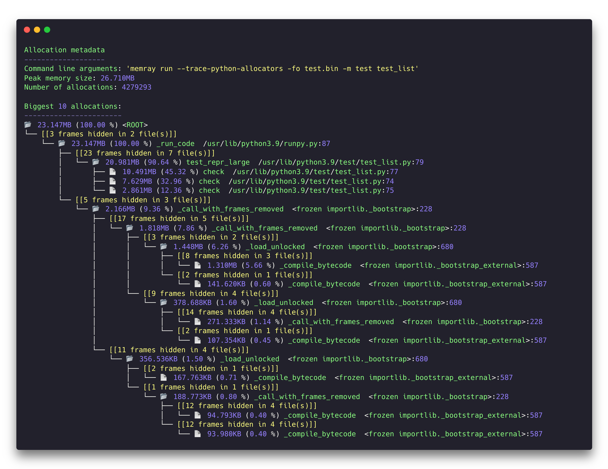

Tree Reporter
==============

The tree reporter provides a simplified representation of the allocation
structure in the target at the time when the memory usage was at its peak.

The tree reporter will show some statistics and a tree representation of the
allocations. Several aspects are important when interpreting the tree
representation:

* Only the biggest 10 allocations are displayed. This is configurable with the
  ``--biggest-allocs`` command line parameter.
* The total memory and percentage shown in the root node of the tree
  corresponds to the total of the allocations displayed (by default 10), which
  means that normally is less than maximum memory at the peak.
* Call chains of one node are collapsed for better readability. This means that
  branches in the tree where each node has only one child are collapsed and a
  special node is shown to reflect this. The hidden frames **never** correspond
  to frames that allocate memory directly themselves but are always parent
  callers of the functions where allocation happen.
* The "📂" icon represents a frame that is a **caller** of a function where an
  allocation happens while the "📄" icon represents a frame that has allocated
  memory.
* Functions and frames involved in allocations that represent a with percentage
  of the total memory allocated by the selected number of biggest allocations
  will be colored more red, while the ones with a lower percentage will be
  colored yellow.
