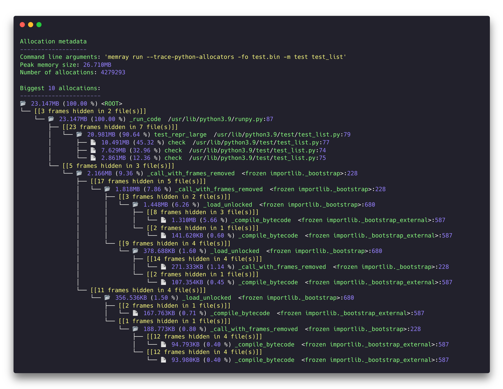

Tree Reporter
==============

The tree reporter provides a simplified representation of the call hierarchy of
the tracked process at the time when its memory usage was at its peak.

The tree reporter shows an interactive terminal application displaying a tree
representation of the allocated memory. Several aspects are important when
interpreting the tree representation:

* Only the 200 source locations responsible for the most allocated bytes are
  displayed. This is configurable with the ``--biggest-allocs`` command line
  parameter.
* The total memory shown in the root node of the tree includes the allocations
  that are not big enough to be shown. Those are summarized together in a
  separate node under the root.
* The "📂" icon represents a frame that is a **caller** of a function where an
  allocation happened while the "📄" icon represents a frame that allocated
  memory.
* Frames are colored based on their reported memory usage percentage, from red
  (most bytes allocated) to green (fewest).
* You can interact with the application using the following keys:

  * You can navigate the tree using the arrow keys. Pressing the up arrow key
    will move up one level in the tree, while pressing the down arrow key will
    move down one row. When a new row is selected, the panel on the right
    will be updated to show the source code of the selected frame and some metadata
    about the allocations made by that frame and its children.
  * Pressing the 'e' key will expand nodes and their children recursively until a node with
    more than one child is found. This can be used to quickly expand the tree.
  * Pressing the 'i' key will hide all nodes that belong to the import system and their
    children.
  * Pressing the 'u' key will show all nodes that are marked as "uninteresting".

.. note::
   If the ``textual[syntax]`` package is installed, the Python source files
   will be displayed with syntax highlighting!

Basic Usage
-----------

The general form of the ``tree`` subcommand is:

.. code:: shell

    memray tree [options] <results>

The only argument the ``tree`` subcommand requires is the capture file
previously generated using :doc:`the run subcommand <run>`.

CLI Reference
-------------

.. argparse::
   :ref: memray.commands.get_argument_parser
   :path: tree
   :prog: memray
