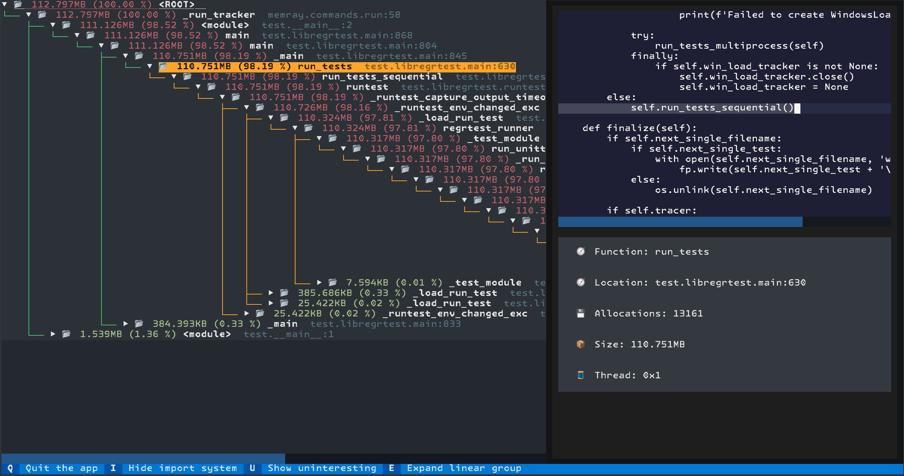

Tree Reporter
==============

The tree reporter provides a simplified representation of the call hierarchy of
the tracked process at the time when its memory usage was at its peak.

The tree reporter shows some statistics followed by a tree representation of
the allocated memory. Several aspects are important when interpreting the tree
representation:

* Only the 10 source locations responsible for the most allocated bytes are
  displayed. This is configurable with the ``--biggest-allocs`` command line
  parameter.
* The total memory and percentage shown in the root node of the tree are
  calculated based only on the allocations that are shown. Since any allocation
  not big enough to be shown will not be included there, the reported total
  memory of the root node is normally less than the process's peak memory size.
* Call chains of one node are collapsed for better readability. This means that
  branches in the tree where each node has only one child are collapsed and a
  special node is shown to reflect this. The hidden frames **never** correspond
  to frames that contained one of the source locations with the biggest
  allocations. The hidden frames are always callers of functions where the reported
  allocation happened.
* The "📂" icon represents a frame that is a **caller** of a function where an
  allocation happened while the "📄" icon represents a frame that allocated
  memory.
* Frames are colored based on their reported memory usage percentage, from red
  (most bytes allocated) to green (fewest).

Basic Usage
-----------

The general form of the ``tree`` subcommand is:

.. code:: shell

    memray tree [options] <results>

The only argument the ``tree`` subcommand requires is the capture file
previously generated using :doc:`the run subcommand <run>`.

The output will be printed directly to standard output. If standard output is
a terminal, the output will be colorized.

CLI Reference
-------------

.. argparse::
   :ref: memray.commands.get_argument_parser
   :path: tree
   :prog: memray
