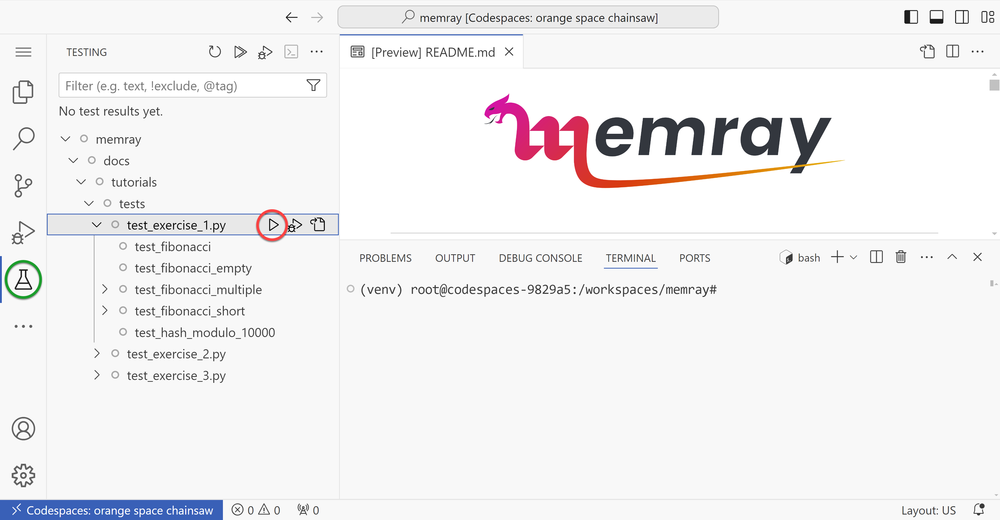
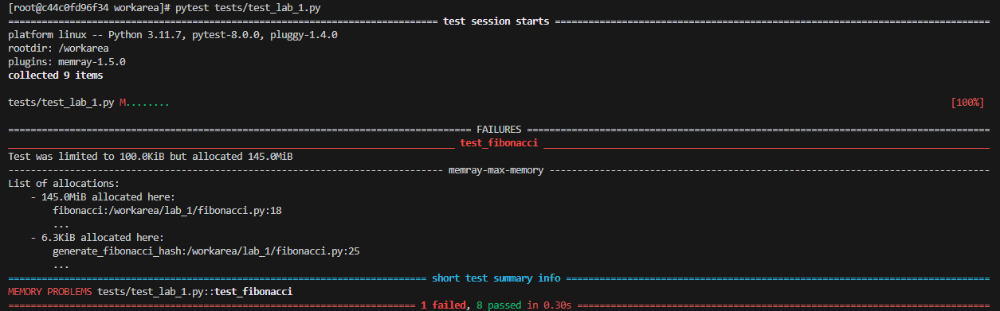
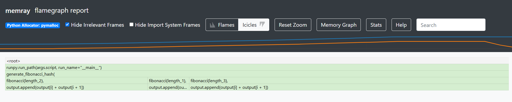
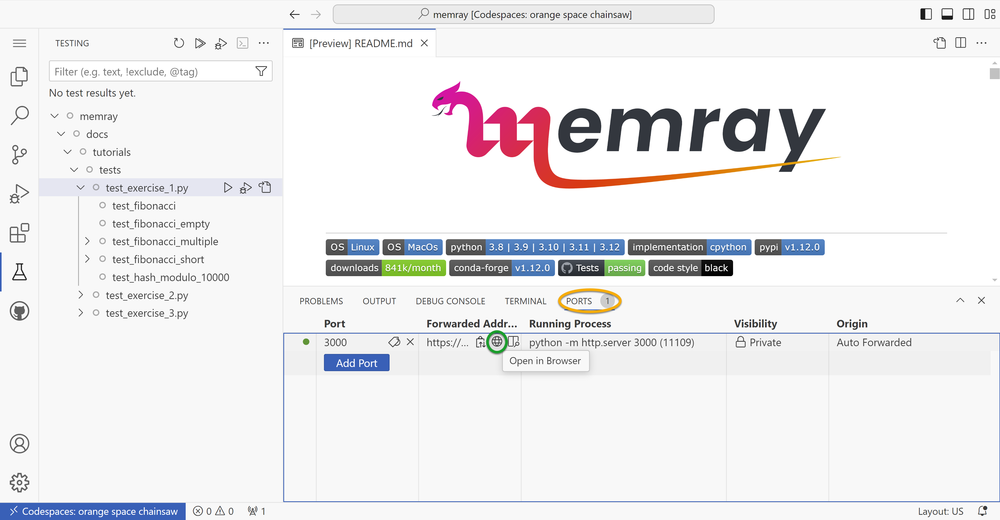

Exercise 1 - Fibonacci Sequence
===============================

Intro
---------

This first lesson is meant to familiarize you with the methods and tools we will be using for the
rest of the exercises. By the end of it, you should understand:

- Basic integration of Memray with pytest
- How to run a python script with Memray
- How to generate and interpret a flame graph

In this first example, we will be calculating and printing the results of a Fibonacci sequence of a
specified number of elements. Python has some great standardized practices for iterating over large
sequences that you will have an opportunity to learn about.

This tutorial supports two modes of development: GitHub Codespaces or a local virtual environment.
Feel free to choose the option more suitable to you below.

Development Environment Setup
-----------------------------

Codespaces Environment
^^^^^^^^^^^^^^^^^^^^^^

To create a new Codespace, click this button, and follow the prompts. It should take approximately 1-2 minutes to setup.

.. raw:: html

  

Local Virtual Environment
^^^^^^^^^^^^^^^^^^^^^^^^^

Navigate to the `Memray GitHub repo <https://github.com/bloomberg/memray>`_ and get a copy of the
source code. You can either clone it, or just download the zip, whatever is your preference here.

You will also need a terminal with ``python3`` installed, preferably one of the latest versions.
You can see which versions of ``python3`` are currently supported at the Memray GitHub page as well.

Once you have the repo ready to navigate, ``cd`` into the docs/tutorials folder:

.. code:: shell

    cd docs/tutorials/

It is here where we will be running the tests and exercises for the remainder of the tutorial.
For reference here are the official `python3 venv docs <https://docs.python.org/3/library/venv.html>`_.
You can also just follow along with the commands below.

Let's go ahead and setup our virtual environment.

.. code:: shell

    python3 -m venv .venv

Once your virtual environment has been created, you can activate it like so:

.. code:: shell

    source .venv/bin/activate

You can confirm activation was successful if your terminal prompt is prefixed with ``(.venv)``.
With our virtual environment ready, we can go ahead and install all the dependencies required
for the tutorial.

.. code:: shell

    python3 -m pip install -r requirements-tutorial.txt

Keep your virtual environment activated for the rest of the tutorial, and you should be able to run
any of the commands in the exercises.

Pytest plugin for Memray
------------------------

Memray supports the ability to augment your pytest tests to enforce an upper bound on your code's
memory usage. This will then cause the test to fail if it uses more than the allowed amount of
memory during the tests execution. Take a look at exercise 1's test: there is a line that specifies
``@pytest.mark.limit_memory`` . This is how we set our upper bound memory limit. Markers like this
are used for all of the tests covered in this workshop.

Codespaces Test Execution
^^^^^^^^^^^^^^^^^^^^^^^^^

Your Codespace should be pre-configured to include the testing plugin. Click the flask on the
navigator (circled in green below). This will open the Testing tab, which will include all the
tests we will be running during this tutorial. Drill down into exercise 1: here you will see
a handful of tests configured for your first exercise. You can execute this group of tests by
clicking the play button (circled in red below).

Local Virtualenv Test Execution
^^^^^^^^^^^^^^^^^^^^^^^^^^^^^^^

Pytest is already installed in your virtual environment, so you can simply invoke it to execute your tests.
Run the following command in your terminal, it will search all subdirectories for tests.
This will test the entire workshop.

.. code:: shell

    pytest

It can be tedious to test all exercises when we are working on 1 exercise at a time. To save time,
let's run only the tests for exercise 1.

.. code:: shell

    pytest tests/test_exercise_1.py

Understanding the results
^^^^^^^^^^^^^^^^^^^^^^^^^

Do you notice any issues with your test case? Initially we should see that the test is failing with
some additional information. Looks like our test case allocated more memory than we allotted for. We
will be taking advantage of this amazing feature included with Memray to help run our workshop. Your
goal for each exercise will be to modify the exercises (NOT the tests), in order to respect these memory limits.

Flame graphs, what are they?
----------------------------

OK, so we know our test is broken. How can we use Memray to help us dive deeper into the underlying
problem? The answer is: a flame graph! A flame graph is a tool used to visualize the memory usage of
a program at a particular point in time. Memray can generate an HTML file that renders a *flamegraph
report*.

The *flamegraph report* is made up of three sections. At the top we have some controls to adjust the
appearance of our report. The middle portion of the screen shows a line plot where we can see total
memory usage of our program plotted over time. The vertical (Y) axis is memory used, and the
horizontal (X) axis is time. The bottom portion is the flame graph, which displays a snapshot of the
program's memory usage from only a single moment in time out of the entire execution runtime of the
program. By default, Memray generates reports showing the point when the program's memory usage
reached its peak. Each row in the flame graph is a frame in your stack trace. The width of each box
represents the relative amount of memory used. In *icicles* mode, the lowest row is the top of the
stack, and shows the functions that allocated memory, while in *flames* mode, the rows are flipped
such that the top row shows the top of the stack and is the location where memory is allocated.

You can click on a particular box to filter out less recent frames from the stack, focusing on a
particular frame and the functions it called into.

More information on the :doc:`flame graph reporter <../flamegraph>` and how to
:ref:`interperet flame graphs <interpreting flame graphs>` are available in the docs.

Generating a Flame Graph
------------------------

Codespaces Flame Graph Generation
^^^^^^^^^^^^^^^^^^^^^^^^^^^^^^^^^

From VS Code, open up 2 terminals. You can do this by typing Ctrl+Shift+P (Cmd+Shift+P on macOS) to
open the "command palette", and then typing "terminal" in the search box and selecting "Python:
Create Terminal".

We need to launch an HTTP server to view our generated flame graphs. Run this command in one of your
terminals:

.. code:: shell

    python -m http.server 3000

You should now see a prompt to launch the application in your browser, and should click "Open in
Browser" in the bottom right. If that prompt doesn't appear, you can navigate to the *Ports* tab
(circled in orange below) and click the *Open in Browser* button (circled in green below). This will
give you an HTTP server we will use in order to launch and view our generated flame graphs.

In your second terminal, navigate to the ``exercise_1`` directory via

.. code:: shell

    cd docs/tutorials/exercise_1/

Run the first exercise labeled ``fibonacci.py``, but make sure to have Memray wrap this call.

.. code:: shell

    memray run fibonacci.py

After the run is complete, Memray will conveniently print the command to generate a flame graph from
the Memray output file. For example, we will run:

.. code:: shell

    memray flamegraph memray-fibonacci.py.<run-id>.bin

.. note::

    The run id will change each time you run the command.

Now that we have generated our flame graph, let's load it up and have a look at it.
To do so, open the tab in your browser with your HTTP server, click on ``docs/tutorials/exercise_1``
directory, and then click on the flame graph (it should have an html file extension)

Voila! We have generated our very first flame graph. Try clicking around the graph and exploring some
of the features of Memray.

Venv Flame Graph Generation
^^^^^^^^^^^^^^^^^^^^^^^^^^^

Run the first exercise labeled ``fibonacci.py``, but make sure to have Memray wrap this call.

.. code:: shell

    memray run exercise_1/fibonacci.py

After the run is complete, Memray will conveniently print the command to generate a flame graph from
the Memray output file. For example, we will run:

.. code:: shell

    memray flamegraph exercise_1/memray-fibonacci.py.<run-id>.bin

.. note::

    The run id will change each time you run the command.

Now that we have generated our flame graph, you can launch the HTML output file in your web browser.

Challenge
---------

Take a closer look at the stack on the flame graph — you will notice that the ``output.append`` call
appears to be the source of almost all of our script's allocations. Maybe that could be used as
a clue as to what in particular we may want to change to pass our test?

.. code-block:: python
    :emphasize-lines: 13

    def fibonacci(length):
        # edge cases
        if length < 1:
            return []
        if length == 1:
            return [1]
        if length == 2:
            return [1, 1]

        output = [1, 1]

        for i in range(length - 2):
            output.append(output[i] + output[i + 1])  # <- Here!

        return output

Try to edit ``fibonacci.py`` to make the program more memory efficient. Test your solution by running
the ``test_exercise_1.py`` unit test, and inspect the effect your changes have on the memory allocation by
generating new flame graphs. Ensure you don't break any of the correctness tests along the way!

.. raw:: html

    

    
<i>Toggle to see the sample solution</i>

After examining the flame graph, we can see that the problem is caused by this intermediate array
``output`` that we are using in order to capture and return the results of the calculation.

Python has an amazing construct that works well in this situation called
`generators <https://wiki.python.org/moin/Generators>`_.

Essentially, a generator works by pausing execution of your function when a ``yield`` statement is
reached, saving the state of the function for later. After each iteration, we can resume that paused
function in order to retrieve the next value that is needed. This is more memory efficient than
processing the entire loop and saving the results in memory — especially when you have 100,000
iterations! ::

    def fibonacci(length):
        # edge cases
        if length < 1:
            return
        if length == 1:
            yield 1
            return

        left = right = 1
        yield left
        yield right

        for _ in range(length - 2):
            left, right = right, left + right
            yield right

Full code solution `here <https://github.com/bloomberg/memray/blob/main/docs/tutorials/solutions/exercise_1/fibonacci.py>`_.

.. raw:: html

    

Conclusion
----------

We should try to avoid loading the entire result set into memory (like into a list) when we plan to
iterate on that result set anyways. This is especially true when your result set is very large. It is
typically best to work with generators in these types of situations.

.. note::

    Sometimes it is better to do all the calculations up front. Generators are far more memory
    efficient than lists, but iterating over generators is slightly slower than iterating over
    lists, and generators can only be iterated over once. The solution with the best trade-offs will
    vary from case to case.

Using Memray's flame graph can be a quick and easy way to identify where your application has
a memory bottleneck.
