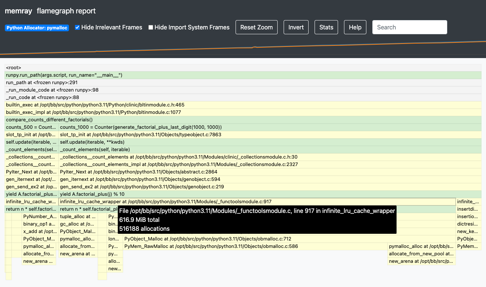

Exercise 3 - LRU Cache
======================

Intro
-----

In :doc:`exercise 2 <2>` we experimented with how and when Python automatically deallocates memory.
This exercise will delve deeper into the automatic deallocation logic used in Python.

In Python, Garbage Collection is when the program identifies and releases blocks of memory that are
no longer in use. The Python Garbage Collector (GC) operates while the program is running and is
activated when the reference count of a particular object in memory reaches zero. The reference
count increases when an object is given a new name or is placed in a container such as a tuple or
a dictionary. Conversely, the reference count decreases when a name referring to the object is
reassigned to a different object instead, or a variable referring to the object goes out of scope,
or when a container referencing the object is destroyed.

The automatic garbage collection is really helpful, however, it may not clear all blocks of memory
we would expect it to.

Symbolic information in native mode
-----------------------------------

When passing the ``--native`` flag to the ``run`` subcommand, Memray will collect information about
the native call stack leading to each allocation, and it will dump it to the result file. This
information is in a raw form where every call is identified by a number called the "instruction
pointer" or "program counter". When creating reports, Memray needs to convert these instruction
pointers into human readable information, like the function name, the file name where that function
is defined, and the line number within that file corresponding to the instruction.

This is particularly helpful when working with libraries written in a native language like C, C++,
Fortran, or Rust (for instance ``functools``, ``numpy``, ``cryptography``, etc).

Read more about how Memray resolves symbols in "native" mode :doc:`here <../native_mode>`.

Working Through an Example
^^^^^^^^^^^^^^^^^^^^^^^^^^

Let's work through another example where data is held in memory longer than we may expect.

Exercise
""""""""

Let's have a look at the example in ``lru_cache.py`` under exercise 3: can you spot any
memory-related bugs in the code? Try running ``memray`` and generating a ``flamegraph`` — was the
memory allocated the way you expected it to be?

Challenge
"""""""""

Experiment with the code in ``lru_cache.py`` and try to get the peak memory usage down to 70MB. Test
your solutions by running the unit test in ``tests/test_exercise_3.py`` and examine them with the
help of ``memray`` reports.

Utilizing the Native mode
"""""""""""""""""""""""""

Let's have a look at our flamegraph — we can see that the majority of the allocations come from the
return statement in the ``factorial_plus()`` method. That's quite odd, as the statement doesn't look
to be doing any memory heavy operations.

.. image:: ../_static/images/exercise3_flamegraph_basic.png

Let's give the ``--native`` mode a go and see if we can uncover what might be causing the underlying
memory-heavy operations. Can you spot anything new that might help us understand what's causing such
high memory usage?

Hints
"""""

.. raw:: html

    

    
<i>Hint 1</i>

The ``cache`` decorator works with methods that have hashable arguments - it caches the result of the
decorated method per unique list of parameters. The results in the cache are kept alive until they
age out (we have not set the size limit for our cache so this will never happen) of the cache or
until the cache is cleared manually.

Let's have another look at the method being cached::

    @functools.cache
    def factorial_plus(self, n: int) -> int:
        return n * self.factorial_plus(n - 1) + self.inc if n else 1 + self.inc

How and which of the method calls be cached?

.. raw:: html

   

.. raw:: html

   

   
<i>Hint 2</i>

Remove the comment ``# pylint: disable=W1518`` on line ``17``, and then run ``pylint`` to see
another hint.

.. raw:: html

   

Solutions
"""""""""

.. raw:: html

   

   
<i>Toggle to see the sample solutions</i>

There are many different approaches to fix this memory issue - here are a few of them:

1. The ``cache`` decorator calls ``functools.lru_cache(maxsize=None)``. The ``lru_cache`` object
   itself stores ("memoizes") the results, and retains references to all argument values passed to
   the decorated function in the cache. So, if we invoke such a decorated function with an object as
   a parameter, that object will persist in memory indefinitely, until the program terminates. If no
   other object ever compares equal to that object, we can never again get a cache hit for it,
   thereby squandering cache space. This scenario frequently arises when decorating a method, with
   the first parameter being ``self``.

   One solution for this specific case involves utilizing a dedicated memoization method that stores
   the cache on the ``self`` object itself. This arrangement ensures that the cache is released
   alongside the object. ::

    class Algorithms:
        def __init__(self, inc: int):
            self.inc = inc
            self.factorial_plus = functools.cache(self._uncached_factorial_plus)

        def _uncached_factorial_plus(self, n: int) -> int:
            return n * self.factorial_plus(n - 1) + self.inc if n else 1 + self.inc

    def generate_factorial_plus_last_digit(plus_range: int, factorial_range: int):
        for i in range(plus_range):
            A = Algorithms(i)
            for j in range(factorial_range):
                yield A.factorial_plus(j) % 10

   Full code solution `here
   <https://github.com/bloomberg/memray/blob/main/docs/tutorials/solutions/exercise_3/lru_cache.py>`_.

2. Or you can use a ``classmethod`` for the cache instead of an instance method::

    class Algorithms:
        def __init__(self, inc: int):
            self.inc = inc

        def factorial_plus(self, n: int) -> int:
            return self.factorial_plus_impl(n, self.inc)

        @classmethod
        @functools.cache
        def factorial_plus_impl(cls, n: int, inc: int) -> int:
            return n * cls.factorial_plus_impl(n - 1, inc) + inc if n > 1 else 1 + inc

3. Another approach would be setting a maximum size for the cache. We can do
   that by passing an argument to ``@lru_cache`` decorator directly.

   .. note::

    ``@cache`` just wraps ``@lru_cache`` with some default arguments;
    we can only set the cache size ourselves if we use the ``@lru_cache``
    decorator directly.

   .. code-block:: python

    @functools.lru_cache(maxsize=10000)
    def factorial_plus(self, n: int) -> int:
        return n * self.factorial_plus(n - 1) + self.inc if n else 1 + self.inc

   ``maxsize=`` here sets the maximum number of values stored in the cache.

4. Finally, we can periodically manually invoke the cleanup of the cache. This can be done by calling
   ``Algorithms.factorial_plus.cache_clear()``

.. raw:: html

   

Conclusion
^^^^^^^^^^

The ``@functools.cache`` decorator is a powerful tool that can help make our programs much more
efficient. It is crucial to fully understand how this decorator works before attempting to use it.
By decorating an instance method, we have included the instance of this class (``self``) as part of
the key to our cached data. This can easily lead to unexpected memory leaks when working with
multiple instances of this class. That is because the LRU cache retains references to all of the
arguments of the decorated function in its cache. Consequently, if we invoke such a decorated
function with an object as an argument, that object will persist in memory indefinitely, or until
the program terminates or the cache is cleared (reference counts in the GC for those cached objects
are always > 0). If no other object instance ever compares equal to the one we've used as a cache
key, we'll never get a cache hit but are unnecessarily holding the object alive as a cache key,
leading to unnecessary memory consumption.

In this tutorial we've learned to use Memray, either through manual inspection of Python scripts or
via the pytest API. These methods are helpful tools for catching these, and other similar unexpected
memory-related behaviors.

Read more about:

- Python GC memory reference counting mechanism, `reference count official documentation
  <http://docs.python.org/extending/extending.html#reference-counts>`_
- Best ways to cache method calls, `the official faq
  <https://docs.python.org/3/faq/programming.html#faq-cache-method-calls>`_
- The original issue on the python language repo going over the details of misuse of lru_cache when
  decorating methods `on github <https://github.com/python/cpython/issues/64058>`_
