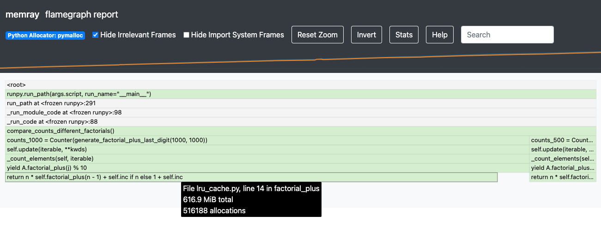

Exercise 3 - LRU Cache
======================

Intro
-----------

In exercise 2 we experimented with how and when python automatically deallocates memory. This exercise will delve deeper into the automatic deallocation logic used in Python.

In Python, Garbage Collection is when the program identifies and releases blocks of memory that are no longer in use. The Python Garbage Collector (GC) operates while the program is running and is activated when the reference count reaches zero. The reference count increases when an object is given a new name or is placed in a container such as a tuple or dictionary. Conversely, the reference count decreases when an object's reference is reassigned, when the reference to an object goes out of scope, or when an object is deleted.

The automatic garbage collection is really helpful, however, it may not clear all blocks of memory we would expect it to.

Symbolic information in native mode
-------------------------------------

When passing the ``--native`` flag to the the run subcommand, Memray will collect information about the native call stack leading to each allocation, and it will dump it to the result file. This information is in a raw form where every call is identified by a number called the “instruction pointer” or “program counter”. When creating reports, Memray needs converts these instruction pointers into human readable information, like the function name, the file name where that function is defined, and the line number within that file corresponding to the instruction.

This is particularly helpful when working with libraries written in C/C++ natively (for instance ``functools``, ``numpy`` etc).

Read more about how Memray resolves symbols in 'native' more `here <https://bloomberg.github.io/memray/native_mode.html>`_.

Working Through an Example
^^^^^^^^^^^^^^^^^^^^^^^^^^^^^^^^^^^^^

Let's go through another working example where data is held in memory longer than we may expect.

Exercise
"""""""""""

Let's have a look at the example in ``lru_cache.py``: can you spot any memory-related bugs in the code? Try running ``memray`` and generating a ``flamegraph`` - was the memory allocated the way you expected it to?

Challenge
"""""""""""

Experiment with the code in ``lru_cache.py`` and try to get the peak memory usage down to 70MB. Test your solutions by running the unit test in ``tests/test_exercise_3.py`` and examine them with the help of ``memray`` reports.

Utilising the Native mode
"""""""""""""""""""""""""""
Let's have a look at our flamegraph - we can see that the majority of the allocations come from the return statement in the ``factorial_plus()`` method. That's quite odd, as the statement doesn't look to be doing any memory heavy operations.

Let's give the ``--native`` mode a go and see if we can uncover what might be causing the underlying memory-heavy operations. Can you spot anything new that might help us understand what's causing such high memory usage?

.. image:: ../_static/images/exercise3_flamegraph_native.png

Hints
""""""

.. raw:: html

   

    
<i>Hint 1</i>

      The <code>lru_cache()</code> works with methods that have hashable arguments - it caches the result of the decorated method per unique list of parameters. The results in the cache are kept alive until they age out (we have not set the size limit for our cache so this will never happen) of the cache or until the cache is cleared manually.

      Let's have another look at the method being cached:
      <pre>
         <code style="display: block; white-space: pre-wrap;" >
         @functools.cache
         def factorial_plus(self, n: int) -> int:
            &emsp;return n * self.factorial_plus(n - 1) + self.inc if n else 1 + self.inc
         </code>
      </pre>

      How and which of the method calls be cached?

   

   

      
<i>Hint 2</i>

      Remove the comment <code># pylint: disable=W1518</code> on line <code>17</code>, and then run <code>pylint</code> to see another hint.

   

Solutions
""""""""""""""

.. raw:: html

   

   
<i>Toggle to see the sample solutions</i>

   There are many different approaches to fix this memory issue - here are a few of them:

   <ul>
   <li>The <code>@cache</code> decorator calls <code>functools.lru_cache(maxsize=None)</code>. The <code>lru_cache</code> itself stores the results at an instance level, and retains references to all argument values passed to the decorated function in the cache. Consequently, if we invoke such a decorated function with an object as a parameter, that object will persist in memory indefinitely, until the program terminates. This situation is wasteful because once we no longer possess any other references to that object, we can never again call the function with the same parameter, thereby squandering cache space. This scenario frequently arises when decorating a method, with the first parameter typically being <code>self</code>.

   One solution for this specific case involves utilizing a dedicated memoization method that stores the cache on the <code>self</code> object itself. This arrangement ensures that the cache is released alongside the object.

   <pre>
   <code style="display: block; white-space: pre-wrap;" >
   class Algorithms:
      def __init__(self, inc: int):
         self.inc = inc
         self.factorial_plus = functools.cache(self._uncached_factorial_plus)

      def _uncached_factorial_plus(self, n: int) -> int:
         return n * self.factorial_plus(n - 1) + self.inc if n else 1 + self.inc

   def generate_factorial_plus_last_digit(plus_range: int, factorial_range: int):
      for i in range(plus_range):
         A = Algorithms(i)
         for j in range(factorial_range):
            yield A.factorial_plus(j) % 10
   </code>
   </pre>

   Full code solution <a href="https://github.com/bloomberg/memray/blob/main/docs/tutorials/solutions/exercise_3/lru_cache.py">here</a>
   </li>

   <li>Another approach, would be setting a maximum size for the cache. We can do that, by passing an argument to <code>@lru_cache</code> decorator directly. Note: <code>@cache</code> underneath just uses <code>@lru_cache</code> with some default arguments; we can only set the cache size ourselves if we use the <code>@lru_cache</code> decorator directly:

      <pre>
      <code style="display: block; white-space: pre-wrap;" >
      @functools.lru_cache(maxsize=10000)
      def factorial_plus(self, n: int) -> int:
         return n * self.factorial_plus(n - 1) + self.inc if n else 1 + self.inc
      </code>
      </pre>

      <code>maxsize</code> here sets the maximum number of values stored in the cache.
   </li>

   <li>Finally, we can periodically manually invoke the cleanup of the cache. This can be done by calling <code>Algorithms.factorial_plus.cache_clear()</code></li>

   </ul>

   

Conclusion
^^^^^^^^^^^^^^^^^^^^^

Functools ``@cache`` decorator is a very powerful tool that can help make our programs much more efficient. It is crucial to fully understand how this decorator works before attempting to use it. By decorating a class method, we have included the instance of this class ``self`` as part of the key to our cache dictionary. This can very easily lead to unexpected memory leaks when working with multiple instances of this class. That is because the LRU cache retains references to all of the parameter values of the decorated function in its cache. Consequently, if we invoke such a decorated function with an object as an argument, that object will persist in memory indefinitely, or until the program terminates (reference counts in the GC for those objects are always > 0). This creates a clear inefficiency since when we no longer have any other reference to that object, we are unable to call that function with the same parameter ever again, leading to unnecessary memory consumption.

This is an example teaching us that a prophylactic use of Memray, whether using manual inspection or the pytest api, can be a helpful tool for catching these, and similar, unexpected memory-related behaviors.

Read more about:

- Python GC memory reference counting mechanism, `reference count official documentation <http://docs.python.org/extending/extending.html#reference-counts>`_
- Best ways to cache method calls, `the official faq <https://docs.python.org/3/faq/programming.html#faq-cache-method-calls>`_
- The original issue on the python language repo going over the details of misuse of lru_cache when decorating class' methods `on github <https://github.com/python/cpython/issues/64058>`_
